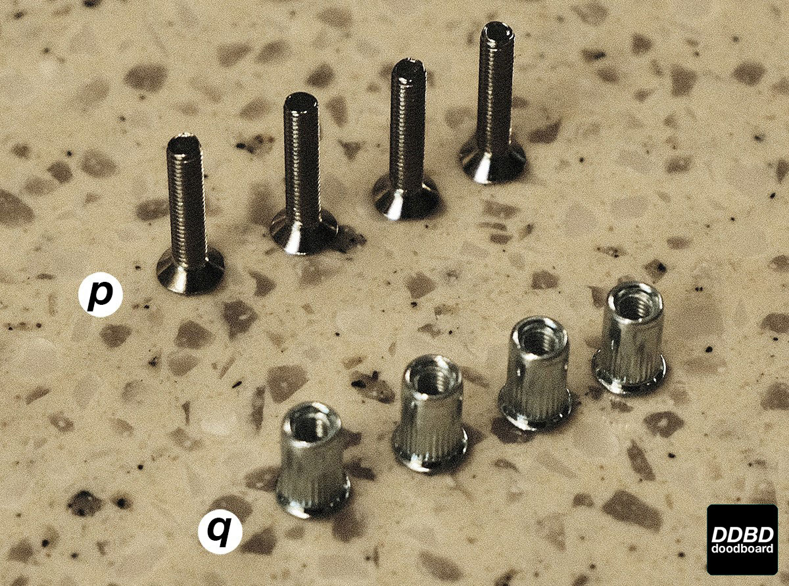
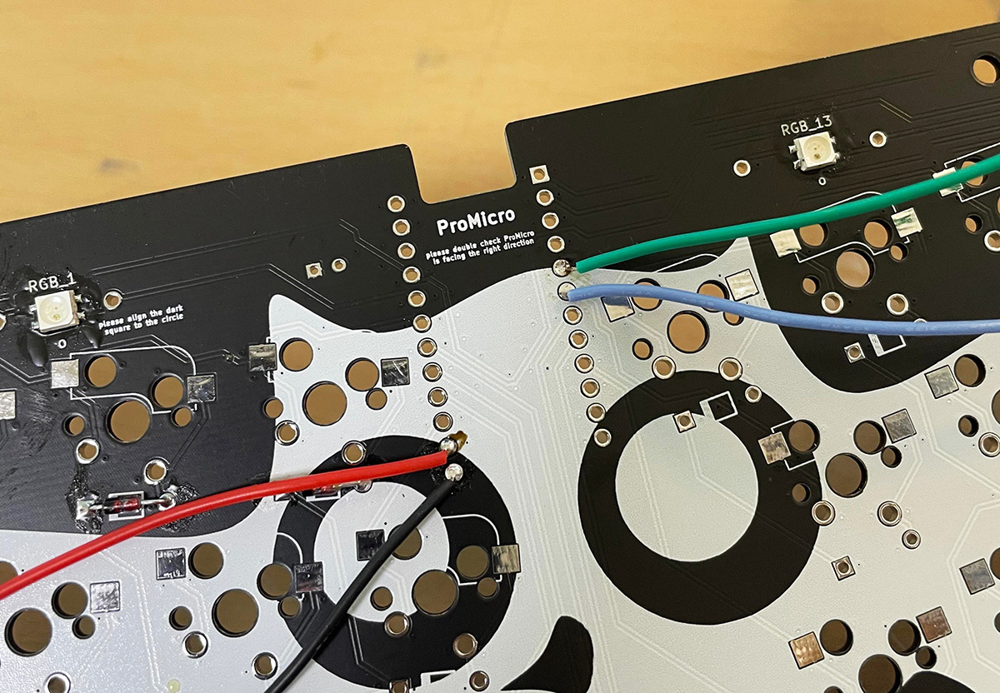
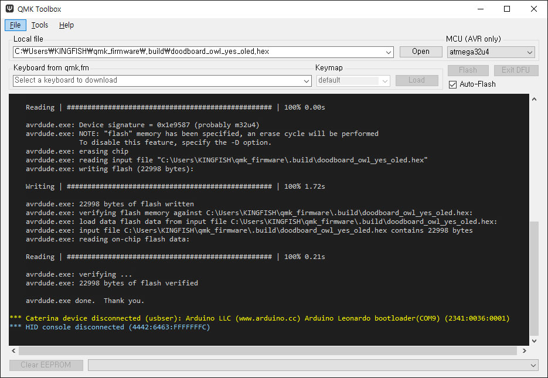
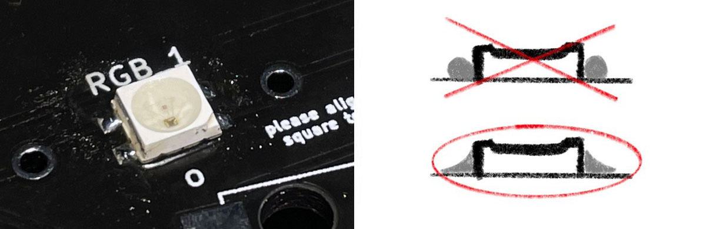
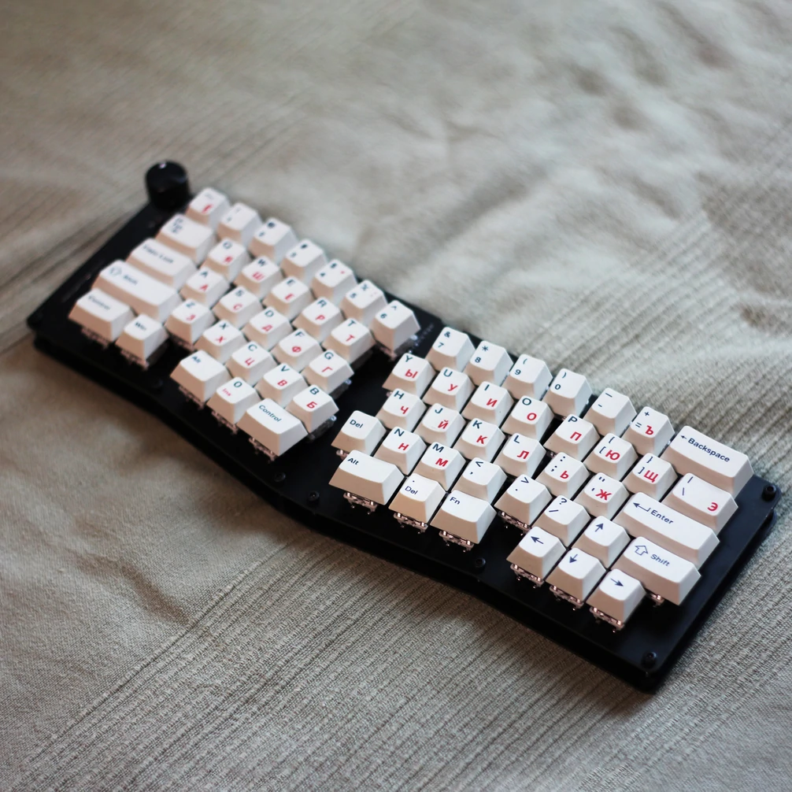

# Build guide for R1 owl

Here is a comprehensive build guide for **R1** owl, written by **doodboard**
 
last update - Jan/1st/2022

## Table of Contents

* [prerequisites](#prerequisites)
* [components](#components)
* [ProMicro](#promicro)
* [flashing](#flashing)
* [LEDs](#leds)
* [diodes](#diodes)
* [hotswap sockets](#hotswap-sockets)
* [rotary encoder](#rotary-encoder)
* [top plate](#top-plate)
* [OLED](#oled)
* [assembly](#final-assembly)

You may also want to read the [FAQs](faqs.md).

 

## prerequisites

There are some items you will need in order to build your owl.

### Required

* A [soldering iron](https://en.wikipedia.org/wiki/Soldering_iron) that can operate at or below 300° Celsius (572° Fahrenheit).
* [Solder](https://en.wikipedia.org/wiki/Solder) to join the components to the PCB. The type of solder depends on your preference.
* A small [Phillips](https://en.wikipedia.org/wiki/List_of_screw_drives#Phillips) screwdriver. Size 1 works, as does size 0.
* A willingness to do some soldering and assemble an owl!

### Optional but highly recommended

* [Tweezers](https://en.wikipedia.org/wiki/Tweezers) for gripping the small components.
* Some kind of desoldering tool, such as a solder wick (aka desoldering braid) or solder sucker (aka desoldering pump). This will be extremely helpful in case you make small mistakes along the way. Check out the tools in [this Wikipedia article](https://en.wikipedia.org/wiki/Desoldering#Tools) for more information.
* [Flux](https://en.wikipedia.org/wiki/Flux_(metallurgy)#Soldering) for certain techniques and making your job easier.
* [Wire cutters](https://en.wikipedia.org/wiki/Diagonal_pliers) that are flush-cutting. Flush-cutting is preferred as this will make it easier to get the cuts you need.

### Optional

* If you want to customize the firmware, you will likely need to learn more about QMK. Please check out the [QMK documentation](https://docs.qmk.fm/) as that is out of scope of this tutorial.
* If you are newer to soldering, you may want to check out a guide like the [Adafruit Guide To Excellent Soldering](https://learn.adafruit.com/adafruit-guide-excellent-soldering). This will help create [good solder joints](https://learn.adafruit.com/adafruit-guide-excellent-soldering/making-a-good-solder-joint) and identify and address [common soldering problems](https://learn.adafruit.com/adafruit-guide-excellent-soldering/common-problems).

 
 

## components

### A single owl kit includes the following:

| Label  | Part name         | Part quantity | Possible replacement (if needed)  |
|--------|-------------------|---------------|-----------------------------------|
| **a**  | Hotswap sockets   | 70            | Kailh hotswap sockets             |
| **b**  | Rotary encoder    | 1             | EC-11 Encoder                     |
| **c**  | CD4051            | 1             |                                   |
| &nbsp; |                   |               |                                   |
| **d**  | LEDs              | 15            | SK6812 3535 Mini (search Aliexpress) |
| **e**  | Pro Micro         | 1             |                                   |
| **f**  | OLED              | 1             | .91” 128px x 32px OLED (some may not work. BUY AT YOUR OWN RISK) |
| &nbsp; |                   |               |                                   |
| **g**  | Diode             | 70            | 1N4148 THT Diode                  |
| &nbsp; |                   |               |                                   |
| **h**  | Encoder knob      | 1             |                                   |
| **i**  | Short standoffs   | 10            | h: 3.5mm                          |
| &nbsp; | Long standoffs    | 10            | h: 6.0mm                          |
| **j**  | M2 16mm bolts     | 9             |                                   |
| &nbsp; | M2 nuts           | 9             |                                   |

 
 

### A single acrylics case kit includes the following:

| Label  | Part name                       | Part quantity |
|--------|---------------------------------|---------------|
| **k**  | Acrylics top plate              | 1             |
| **l**  | Acrylics plate                  | 1             |
| **m**  | Acrylics boundary (small holes) | 1             |
| **n**  | Acrylics boundary (big holes)   | 1             |
| **o**  | Acrylics bottom plate           | 1             |

 
 

| Label  | Part name         | Part quantity |
|--------|-------------------|---------------|
| **p**  | M3 16mm bolt      | 8             |
| **q**  | M3 insert nuts    | 8             |

 
 

## ProMicro

### WARNING

The pin assignment of 2 and 16, and 3 and 10 has been reversed on the owl PCB, causing the OLED display to not function.

We had confirmed the functionality of the OLED module earlier in the prototyping phase, and assumed it remained so. 

It is absolutely our fault for not catching it before shipping them out.

 

Currently, there are two options:

1. You can disable the OLED and solder on the ProMicro as is
2. You can solder on the ProMicro with the pins 2, 3, 16, and 10 left empty, and install 4 jumper wires to the owl PCB which will enable the OLED

We are in the process of revising the PCB, and we'll be shipping out replacement PCBs as soon as they reach us. 

 

If you wish to continue the build with the OLED disabled, skip to next [section](#flashing).

If you with to use the OLED, and are willing to make modification to the PCB, 
 
CLICK ME

 

If you chose to **enable the OLED**, and made the required modifications, right click to download the HEX file [**here**](hex/owl_YES_OLED.hex)

### Please flash and test your ProMicro before starting the modification following the steps [here](#flashing) with the HEX file above.

First step is to prepare your ProMicro. Cut the included legs like shown above

 

Then solder them in place like so. Soldering **longer side** of the legs to go into the owl PCB will save you from having to snap the legs later for clearance.   

 

Next step if so prepare the owl PCB. Grab 4 jumper wires, and solder them like shown above. Make sure there aren't any contacts between exposed wires ends and the rest of the components.

 

Then solder the ProMicro in place, then solder the wires like shown above. Pay attention to the color of the wires to see which wire goes where.

Make sure there is no contact between exposed wire ends and the rest of the components. Using electrical tape to insulate the exposed ends after soldering is recommended.

continue to [section](#leds)

 
 

## flashing

### Please flash and test your promicro before starting the build!

If you chose to **disable the OLED**, right click to download the HEX file [**here**](hex/owl_NO_OLED.hex)

If you wish to compile your own hex file, you can grab the **source code** by right clicking [**here**](/source_code/owl.zip)

You can grab **QMK toolbox** from [**here**](https://github.com/qmk/qmk_toolbox)

1. confirm you have downloaded and opened the **right HEX file** on qmk toolbox
2. MCU should be set to **"atmega32u4"**
3. check **Auto-Flash**

 

Plug in your pro micro, and if it doesn't flash automatically, **short GND to RST on pro micro twice, fast.** 
Use a **tweezer** or **pliers** or anything else conductive.

You should see the following if everything went successfully.

 
 

## LEDs 

### Now we'll work on the LEDs. This is the *toughest* part of the build. 

The LEDs are SMD, meaning they are surface mounted as opposed to through hole mounted. 
Therefore, using **flux is highly recommended** as it helps solder to flow under the LEDs far more easily.
I personally prefer flux paste, as opposed to flux pens, but it's up to personal preference.

LEDs provide underglow to the owl. If you find it too frustrating, it's **alright** to forego the LEDs.  
**It won't affect the core functionality of owl as a keyboard. **

LEDs should be positioned as shown above, **the small black square inside the LED should line up with the small circle on the PCB**.

 

[**This**](https://streamable.com/dimwli) is how I solder the LEDs.
1. apply flux to **both** the PCB and the LED with a brush
2. set the soldering iron to **300C** to prevent burning out the LEDs
3. place LED on the PCB. Make sure it's positioned** correctly** on the pads.
4. apply a **small** amount of solder to the soldering iron
5. make a short swiping motion **perpendicular** to the LED
6. repeat for all **4** pads.

 

The finished solder joints should look like the photo above. You are aiming for the **nice slope of solder**, not a blob.
Please make sure you only make contact with the iron for **2-3 seconds** at a time. Longer exposure to heat can burn out the LED.

In the case that you burn through even the extra LEDs provided, model number is **SK6812 3535 mini**.

 
 

## diodes

### Next step is installing the diodes. 

Nothing fancy here. **Align the diodes as shown above**, and solder them in. I recommend using flux, but it's not required.
There are total of **68** diodes to install: 67 for the 67 switches, and 1 for the push function of rotary encoder.

If you plan to use stabilizers, pay extra attention to the diodes near stab housings. 
You should** clip the diode legs flush to the PCB** in order to prevent clearing issue. 

Here is an up-close image of what a soldered diode looks like:

 
 

## hotswap sockets

### And now onto the hotswap sockets.

Again, nothing fancy here. Place the hotswap sockets into the PCB, following the guidelines printed on the PCB.  
If you prefer to solder your switches directly to the PCB, you can skip this process, and solder in the switches later **after** installing the top plate.  

Depending on how you would like to use your thumb row, you should solder your hotswap sockets **accordingly**.

Here is an up-close image of what a soldered hotswap socket looks like:

 
 

### Now is the time to verify your soldering skills. 
Plug in your owl to your PC via **MicroUSB** cable.
All **13** LEDs should light up by default. If only a few of them lights up, follow these steps:

Start working from **LED_1**. The signal line for LEDs are connected in **serial** to help you debugging.
For example, if none of your LEDs light up, try reflowing LED_1. 
If LED_1, 2 and 3 light up, but not 4, try reflowing LED_3 and 4 until 4 lights up.

If some of your LEDs light up in different colour, it's due to **corrupted** signal caused by bad solder joints.
If some of your LEDs work, but not in serial, so for instance LED_1, 2 and 8 light up, the same principle applies. Work between LED 2 and 3 until 3 lights up.

This is the schematic of the LED wiring for reference.

 

This is also the perfect time to test your **keypresses**. You can either plug in the switches to test the keystrokes, or manually short the hotswap sockets. 

Default hex file for R1 has OLED enabled. ProMicro awaits return signal from OLED.
So until the display is installed, keypresses will be **delayed**, and you'll have to hold down each keypress a little bit longer for it to register.

To test without installing switches, short the **blue** circles if you have the **hotswap sockets** installed. Short the **yello** circles if you plan to solder the switches in **directly**.

 

If you have any issues, first make sure your LEDs and diodes are **oriented right**, then **check** your soldering joints to see if they all look OK.
Here is a reference image in courtesy of **adafruit**. 

 
 

## rotary encoder

### Fun fun fun!

No fancy tricks. Solder **7** spots circled above. Make sure the encoder is sitting **flush** to the PCB before you solder it.
The two tabs in the middle are for **structural** purposes only. Apply solder generously. 
The thinner legs to the top and bottom are **malleable**. Bend them a little if they need to be in order to fit the PCB.

You can also install the encoder knob now. **Align** the small screw to the flat face of encoder shaft. Screw it in for stability.

Plug in the USB cable, and test rotation in both directions, and pressing the encoder shaft in. 
It should **increase/decrease** the volume, and **mute/unmute** your media player.

 
 

## top plate

### Almost time to wrap it all up!

#### IF YOU WANT TO INSTALL ACRYLICS CASE, STOP AND CLICK BELOW

	
CLICK ME

 

**Install stabilizers now** before moving on if you wish to use them. For 2u switches, I personally prefer the tactility of not having stabs installed, but that's just my personal opinion.

Grab the acrylics plate labelled "k" and "l" above, and gauge where the OLED needs to be. Solder the OLED in place. 

Then insert 8 x popnuts to the bottom 2 plates ("n" & "o"). Be **gentle**. If too tight, push it in with a hot soldering iron. Do not apply excessive force or the plate might crack.

Place the plate "l" on top of PCB. Slide the plate over the encoder. 

Install your switches. The PCB is held in place by the hotswap sockets and the switches. The force of pressing the switches are transferred directly to the acrylic case.

Assemble with the rest of your acrylic plates and screw them in place. That's it, your are **done**. Install keycaps to your liking and type away!

-------------------------------------------------------------------------------------------------

**Install stabilizers now** before moving on if you wish to use them. For 2u switches, I personally prefer the tactility of not having stabs installed, but that's just my personal opinion.
Place the screws into the plate, and screw in the **shorter** standoffs. Then place the top plate onto the PCB, and screw in the **longer** standoffs.
You may find it easier to hold the standoffs with **pliers** while screwing them in place.

 
 

## OLED

### 4 last solder joints

**Remove the black plastic** from the OLED pins. Pull them out **gently** using your fingers or pliers if necessary.

Install the OLED in place. Make sure the OLED module is **parallel** to the top plate, and is **positioned correctly** before soldering into place.

Plug in the USB cable once again at this point and ensure **everything** checks out. If you chose to solder the switchs in directly, now is the time to do so.

 
 

## final assembly

### FINISHED

Place the bottom plate in position and screw in the 4 x M2 nuts to finish off the build. **Install switches and keycaps to your liking, and type away**!

[**Here**](img/KLE.jpg) is the default **keymap** for reference. 

[**Here**](img/pinout_1.JPG) is the pinout diagram for troubleshooting. 

 

Thank you so much for coming along this journey! R4 is planned for **JULY/AUGUST 2021**, I hope to see you guys again, **soon!**

  

## what's next?

You can add your favourite stabilizers, switches, and keycaps! If you are interested in changing the default keymap or other functionality of the board, you may also want to learn about [QMK](https://docs.qmk.fm/) and use the [duckboard source code](https://github.com/doodboard/source-code).
